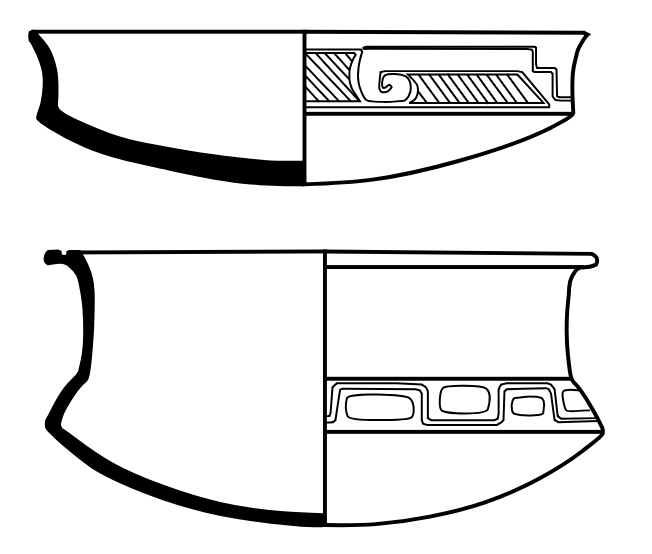
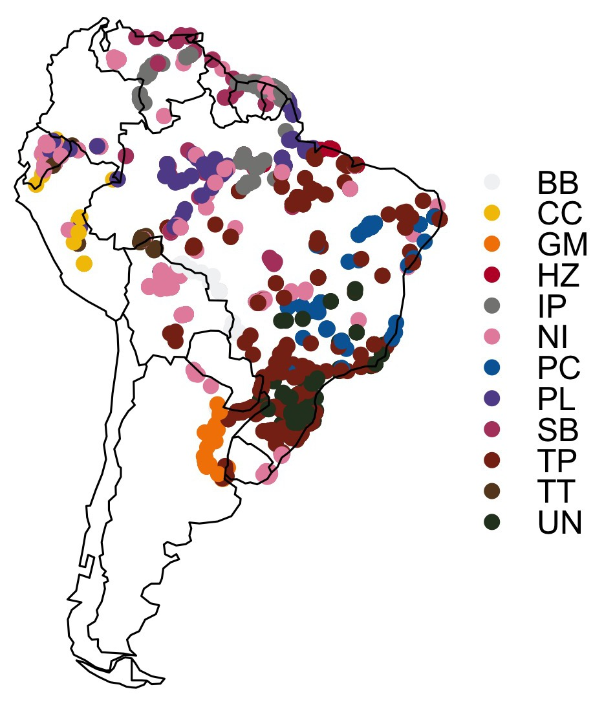
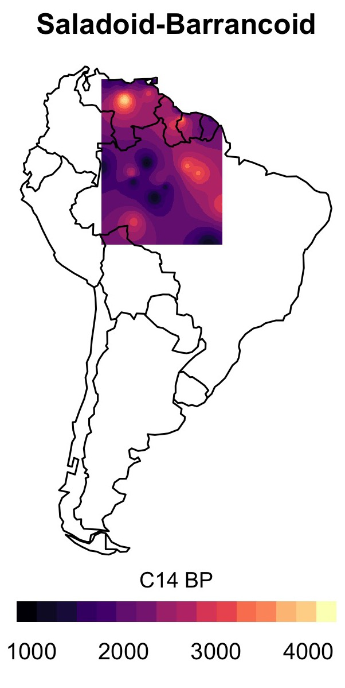

# rxpand
<h2>Radiocarbon dates for the spread of farming and ceramics in tropical South America</h2>

</img>

Jonas Gregorio de Souza 
 

This package contains a dataset with 2762 radiocarbon dates from 1023 archaeological sites in lowland South America. In principle, only archaeological cultures related to the spread of polyculture agroforestry (tropical forest farming) and ceramics are represented. The dataset has been compiled and is continuously updated as part of the project <a href="https://amazonexpand.wixsite.com/expand">ExPaND: Examining Pan-Neotropical Diasporas</a> funded by the European Commission H2020.

<h3>Data</h3>

The data are stored in the object <i>xpand</i>, a SpatialPointsDataFrame. Variables are the following:

<ul>
  <li><b>Site:</b> Site name and code (if available).</li>
  <li><b>C14Age:</b> The radiocarbon date(s) for the site.</li>
  <li><b>C14SD:</b> Standard error of the radiocarbon determination.</li>
  <li><b>LabCode:</b> Laboratory code, if available.</li>
  <li><b>Material:</b> The material dated, i.e. wood charcoal, marine shell, human bone etc.</li>
  <li><b>Culture:</b> Cultural affiliation of the site or dated level. See below for a summary of archaeological cultures.</li>
  <li><b>Description:</b> Brief description of the archaeological site, if available.</li>
  <li><b>Comments:</b> Mainly comments about problems with the context or radiocarbon measurement, if there are any.</li>
  <li><b>Reference:</b> Reference for the date in author-year format.</li>
  <li><b>FullReference</b> Full bibliographic reference.</li>
  <li><b>Exclude:</b> A boolean deciding whether the date should be excluded from analyses based on the best judgement of the original publisher or general consensus of the archaeological community in the present.</li>
  <li><b>Class:</b> A simple and broad classification of the various archaeological cultures (see below).</li>
</ul>

The data are made available in SpatialPoints* format to facilitate spatial analyses in R. The original table can also be found in the file <i>expand.csv</i> in the data folder.

<pre><code>load("data/xpand.RDa")
load("data/sam.RDa") #South American country borders
plot(sam)
plot(xpand, add=TRUE, cex=0.5, col="red")</pre></code>
</img>

<h2>Archaeological cultures and chronology</h2>

</img>

In the attribute <i>Class</i>, an experimental classification is provided according to a broad taxonomic scheme devised to simplify the myriad of archaeological cultures in late Holocene tropical South America. The following codes are employed:

<ul>
  <li><b>BB:</b> Bacabal phase, associated with early shell mounds in southwestern Amazon, and similar ceramics in the same region, such as Pimenteira and Jasiaquiri, which are associated with ditched enclosures (Miller 1983; <a href="https://www.researchgate.net/publication/306292334_A_Fase_Bacabal_e_suas_Implicacoes_para_a_Interpretacao_do_Registro_Arqueologico_no_Medio_Rio_Guapore_Rondonia">Zimpel and Pugliese 2012</a>; <a href="https://www.researchgate.net/publication/273886689_100_anos_de_investigaciones_arqueologicas_en_los_Llanos_de_Mojos">Prümers and Jaimes Betancourt 2014</a>).</li>
  <li><b>CC:</b> Cumancaya and other corrugated ceramic phases of western Amazon, such as Huapula, which is associated with large platform mound complexes in Ecuador (Raymond et al. 1975; <a href="https://www.researchgate.net/publication/26431218_Secuencia_arqueologica_en_monticulos_del_valle_del_Upano_en_la_Amazonia_ecuatoriana">Rostain 1999</a>).</li>
  <li><b>GM:</b> Goya-Malabrigo (aka Ribereños Plásticos) mound sites in the Paraná wetlands (<a href="https://doi.org/10.22562/2016.45.06">Loponte and Acosta 2016</a>).</li>
  <li><b>HZ:</b> Zone-Hachured ceramics and other early complexes with similar decoration, such as Mina, mostly associated with shell mounds in eastern Amazon (<a href="https://www.academia.edu/26924057/BANDEIRA_2016_A_CER%C3%82MICA_MINA_NO_MARANH%C3%83O.pdf">Bandeira 2012</a>; <a href="https://doi.org/10.1126/science.254.5038.1621">Roosevelt et al. 1991</a>; <a href="https://repositorio.museu-goeldi.br/handle/mgoeldi/223">Simões 1981</a>).</li>
  <li><b>IP:</b> Ceramic phases attributed to the Incised-Punctate tradition, such as Santarém and Konduri, which appear in <i>terra preta</i> sites in the lower Amazon, together with Arauquinoid ceramics from the Orinoco and Guyanas, where they are associated with mounds and raised fields (<a href="https://www.researchgate.net/publication/315054574_Santarem_Symbolism_and_Power_in_the_Tropical_Forest">Gomes 2001</a>; <a href="https://teses.usp.br/teses/disponiveis/71/71131/tde-05082008-104113/pt-br.php">Guapindaia 2008</a>; <a href="https://doi.org/10.1007/978-0-387-74907-5_16">Rostain 2008</a>). Koriabo ceramics are provisionally included in this group, but recent criticism of that affiliation may lead to its exclusion (Boomert 2004).</li>
  <li><b>NI:</b> Unclassified.</li>
  <li><b>PC:</b> Pedra do Caboclo and other early, simple ceramics from the Brazilian northeast, including unclassified ceramics from many rockshelters (Laroche 1970; Vergne 2004; <a href="https://repositorio.ufpe.br/handle/123456789/10317">Arnaldo 2012</a>), together with the Aratu tradition of the <i>cerrado</i> ring villages, included here due to its similarities with the former (Calderón 1969; Dias Jr. 1975). This affiliation may be reviewed in the future.</li>
  <li><b>PL:</b> Phases belonging to the Amazon Polychrome tradition - Guarita, Jatuarana, Napo and others (<a href="https://www.researchgate.net/publication/319406553_The_Polychrome_Tradition_at_the_Upper_Madeira_River">Almeida and Neves 2014</a>; <a href="https://doi.org/10.11606/D.71.2015.tde-13102015-153201">Belletti 2015</a>). Phases influenced by the Polychrome tradition but independent from it are also included, such as late Aristé (<a href="https://doi.org/10.1007/978-0-387-74907-5_16">Rostain 2008</a>). The Marajoara phase, despite being earlier, is provisionally included here due to its similarities with the Polychrome tradition (<a href="http://d-scholarship.pitt.edu/9161/">Schaan 2004</a>).</li>
  <li><b>SB:</b> Ceramics of the Saladoid and Barrancoid series of the Orinoco, together with the similar phases that mark the onset of permanent occupation in much of central/eastern Amazon, grouped in the Pocó-Açutuba/Incised-Rim tradition (Rouse and Cruxent 1963; <a href="https://www.researchgate.net/publication/268035275_A_tradicao_Poco-Acutuba_e_os_primeiros_sinais_visiveis_de_modificacoes_de_paisagens_na_calha_do_Amazonas">Neves et al. 2014</a>). Later manifestations of this horizon include <i>terra preta</i> sites, mounds and ditches, as in the Paredão, Ipavu and Axinim phases, which are included here (Heckenberger 2005; <a href="https://doi.org/10.18542/amazonica.v4i1.884">Moraes and Neves 2010</a>).</li>
  <li><b>TP:</b> Tupiguarani tradition (<a href="https://teses.usp.br/teses/disponiveis/71/71131/tde-19052008-141426/pt-br.php">Almeida 2008</a>; <a href="https://teses.usp.br/teses/disponiveis/71/71131/tde-17102014-154640/pt-br.php">Corrêa 2014</a>; <a href="https://doi.org/10.1016/j.quaint.2014.10.050">Bonomo et al. 2015</a>).</li>
  <li><b>TT:</b> Ceramics of the Tutishcainyo tradition and related Shakimu and Nazaratequi phases, as well as other similar early ceramics of western Amazon, including those associated with geometric enclosures (Quinari and Tumichucua traditions) (Lathrap 1970; <a href="https://lup.lub.lu.se/record/1890748">Eriksen 2011</a>; <a href="https://doi.org/10.4081/antiqua.2012.e1">Saunaluoma and Schaan 2012</a>).</li>
  <li><b>UN:</b> Una tradition of the <i>cerrado</i> and coast, together with its close relative, the Taquara/Itararé tradition of the southern Brazilian highlands, where it appears associated with pit houses and mounds (<a href="https://doi.org/10.11606/issn.2448-1750.revmae.1996.109255">Robrahn-González 1996</a>; <a href="https://doi.org/10.24885/sab.v20i1.225
">Araujo 2007</a>; <a href="https://doi.org/10.1590/1981.81222017000100004">Noelli and Souza 2017</a>).</li>
</ul>

<pre><code>plt <- spplot(xpand, "Class", xlim=c(-82, -34), ylim=c(-56, 13),
              col.regions=kelly(), sp.layout=list("sp.polygons",
              sam, first=FALSE), par.settings=list(axis.line=list(col="transparent"))
names(plt$legend) <- "right"
plt</pre></code>

</img>

The code includes a function to quickly plot an isochrone map - based on inverse distance weighting and considering only the earliest dates in a radius of 100 km.

<pre><code># Saladoid-Barrancoid subset
sb <- xpand[xpand$Class=="SB" & xpand$Exclude==FALSE,]
isoPlot(xpand, "C14Age", title="Saladoid-Barrancoid")</pre></code>

</img>

<h2>Further analysis</h2>

One can use the package <a href="https://github.com/jgregoriods/spDates">spDates</a> to perform space-time regressions on the South American dates following the methods commonly employed, for instance, for the European Neolithic:

<pre><code>library(spDates)
#Prepare the data as per spDates instructions
#Retain only earliest dates, calibrate and get median
sb <- filterDates(sb, "C14Age")
sb$cal <- calibrate(sb$C14Age, sb$C14SD, calCurves="shcal13")
sb$med <- medCal(sb$cal)
laGruta <- sb[sb$Site=="La Gruta",] #La Gruta is the earliest site
rma <- modelDates(sb, "C14Age", laGruta, binWidth=500)  #Using 500 km bins and reduced major axis
plot(rma)
</pre></code>

</img>

Notice that this example is for illustrative purposes. When creating the cal and med columns, one should take into account, among other things, different calibration curves - e.g. when dates are from marine shell.

<h3>References</h3>

Almeida, Fernando O. 2008. <a href="https://teses.usp.br/teses/disponiveis/71/71131/tde-19052008-141426/pt-br.php">“O Complexo Tupi Da Amazônia Oriental.”</a> São Paulo: University of São Paulo.

Almeida, Fernando O, and Eduardo G Neves. 2014. <a href="https://www.researchgate.net/publication/319406553_The_Polychrome_Tradition_at_the_Upper_Madeira_River">“The Polychrome Tradition at the Upper Madeira River.”</a> In Antes de Orellana: Actas Del 3er Encuentro Internacional de Arqueología Amazónica, edited by S Rostain, 175–82. Quito: Ekseption Publicidad.

Araujo, Astolfo Gomes de Mello. 2007. <a href="https://doi.org/10.24885/sab.v20i1.225
">“A Tradição Cerâmica Itararé-Taquara: Características, Área de Ocorrência e Algumas Hipóteses Sobre a Expansão Dos Grupos Jê No Sudeste Do Brasil.”</a> Revista de Arqueologia 20: 9–38.

Arnaldo, Emilia M A. 2012. <a href="https://repositorio.ufpe.br/handle/123456789/10317">“Uso e Ocupação Dos Espaços Pelos Grupos Ceramistas Da Serra Branca - Sudeste Do Piauí.”</a> Recife: Universidade Federal de Pernambuco.

Bandeira, Arkley Marques. 2012. <a href="https://www.academia.edu/26924057/BANDEIRA_2016_A_CER%C3%82MICA_MINA_NO_MARANH%C3%83O.pdf">“A Cerâmica Mina No Maranhão.”</a> In Cerâmicas Arqueológicas Da Amazônia: Rumo a Uma Nova Síntese, edited by Cristiana Barreto, Helena P Lima, and Carla J Betancourt, 151–61. Belém: IPHAN.

Belletti, Jacqueline S. 2015. <a href="https://doi.org/10.11606/D.71.2015.tde-13102015-153201">“A Arqueologia Do Lago Tefé e a Expansão Polícroma.”</a> São Paulo: University of São Paulo.

Bonomo, Mariano, Rodrigo C Angrizani, Eduardo Apolinaire, and Francisco Silva Noelli. 2015. <a href="https://doi.org/10.1016/j.quaint.2014.10.050">“A Model for the Guaraní Expansion in the La Plata Basin and Littoral Zone of Southern Brazil.”</a> Quaternary International 356: 54–73.

Boomert, A. 2004. “Koriabo and the Polychrome Tradition: The Late-Prehistoric Era between the Orinoco and Amazon Mouths.” In Late Ceramic Age Societies in the Eastern Caribbean, edited by A Delpuech and C L Hofman, 251–66. Oxford: ArchaeoPress.

Calderón, Valentin. 1969. “A Fase Aratu No Recôncavo e Litoral Norte Do Estado Da Bahia.” In Programa Nacional de Pesquisas Arqueológicas: Resultados Preliminares Do Terceiro Ano, edited by PRONAPA, 161–68. Belém: Museu Paraense Emílio Goeldi.

Corrêa, Angelo A. 2014. <a href="https://teses.usp.br/teses/disponiveis/71/71131/tde-17102014-154640/pt-br.php">“Pindorama de Mboîa e Îakaré: Continuidade e Mudança Na Trajetória Das Populações Tupi.”</a> São Paulo: Universidade de São Paulo.

Dias Jr., Ondemar. 1975. “Pesquisas Arqueológicas No Sudeste Brasileiro.” Boletim Do Instituto de Arqueologia Brasileira Série Espe (1).

Eriksen, Love. 2011. <a href="https://lup.lub.lu.se/record/1890748">“Nature and Culture in Prehistoric Amazonia: Using G.I.S. to Reconstruct Ancient Ethnogenetic Processes from Archaeology, Linguistics, Geography, and Ethnohistory.”</a> Lund: Lund University.

Gomes, Denise C. 2001. <a href="https://www.researchgate.net/publication/315054574_Santarem_Symbolism_and_Power_in_the_Tropical_Forest">“Santarém: Symbolism and Power in the Tropical Forest.”</a> In Unknown Amazon, edited by C McEwam, C Barreto, and E Neves, 134–55. London: The British Museum Press.

Guapindaia, Vera. 2008. <a href="https://teses.usp.br/teses/disponiveis/71/71131/tde-05082008-104113/pt-br.php">“Além Da Margem Do Rio - a Ocupação Konduri e Pocó Na Região de Porto Trombetas, PA.”</a> São Paulo: University of São Paulo.

Heckenberger, Michael J. 2005. The Ecology of Power: Culture, Place, and Personhood in the Southern Amazon, A.D. 1000-2000. New York: Routledge.

Laroche, Armand François Gaston. 1970. O Sítio Arqueológico Da Pedra Do Caboclo: Relato de Uma Pesquisa Na Zona Do Agreste Pernambucano. Recife: Secretaria de Educação e Cultura.

Lathrap, Donald Ward. 1970. The Upper Amazon. London: Thames & Hudson.

Loponte, Daniel, and Alejandro Acosta. 2016. <a href="https://doi.org/10.22562/2016.45.06">“Los Contextos Goya-Malabrigo Del Noreste Argentino.”</a> Cadernos Do CEOM 29 (45): 125–87.

Miller, Eurico T. 1983. “História Da Cultura Indígena Do Alto Médio Guaporé (Rondônia e Mato Grosso).” Pontifícia Universidade Católica do Rio Grande do Sul.

Moraes, Claide de Paula, and Eduardo Góes Neves. 2012. <a href="https://doi.org/10.18542/amazonica.v4i1.884">“O Ano 1000: Adensamento Populacional, Interação e Conflito Na Amazônia Central.”</a> Amazônica-Revista de Antropologia 4 (1): 122–48.

Neves, E G, V L C Guapindaia, H Lima, B L S Costa, and J Gomes. 2014. <a href="https://www.researchgate.net/publication/268035275_A_tradicao_Poco-Acutuba_e_os_primeiros_sinais_visiveis_de_modificacoes_de_paisagens_na_calha_do_Amazonas">“A Tradição Pocó-Açutuba e Os Primeros Sinais Visíveis de Modificações de Paisagens Na Calha Do Amazonas.”</a> In Memorias de Las Conferencias Magistrales Del 3er Encuentro Internacional de Arqueología Amazónica, edited by S Rostain, 137–58. Ecuador: Ekseption Publicidad.

Noelli, Francisco Silva, and Jonas Gregorio de Souza. 2017. <a href="https://doi.org/10.1590/1981.81222017000100004">“Novas Perspectivas Para a Cartografia Arqueológica Jê No Brasil Meridional.”</a> Boletim Do Museu Paraense Emílio Goeldi. Ciências Humanas 12: 57–84.

Prümers, H, and C Jaimes Betancourt. 2014. <a href="https://www.researchgate.net/publication/273886689_100_anos_de_investigaciones_arqueologicas_en_los_Llanos_de_Mojos">“100 Años de Investigación Arqueológica En Los Llanos de Mojos.”</a> Arqueoantropológicas 4 (4): 11–54.

Raymond, J Scott, Warren R DeBoer, and Peter G Roe. 1975. Cumancaya: A Peruvian Ceramic Tradition. Calgary: University of Calgary.

Robrahn-González, Erika M. 1996. <a href="https://doi.org/10.11606/issn.2448-1750.revmae.1996.109255">“Os Grupos Ceramistas Pré-Coloniais Do Centro-Oeste Brasileiro.”</a> Revista Do Museu de Arqueologia e Etnologia 6: 83–121.

Roosevelt, Anna Curtenius, R. A. Housley, Maura Imazio da Silveira, Silvia Maranca, and R. Johnson. 1991. <a href="https://doi.org/10.1126/science.254.5038.1621">“Eighth Millennium Pottery from a Prehistoric Shell Midden in the Brazilian Amazon.”</a> Science 254 (5038): 1621–24.

Rostain, Stéphen. 1999. <a href="https://www.researchgate.net/publication/26431218_Secuencia_arqueologica_en_monticulos_del_valle_del_Upano_en_la_Amazonia_ecuatoriana">“Secuencia Arqueológica En Montículos Del Valle Del Upano En La Amazonía Ecuatoriana.”</a> Bulletin de L´Institut Français D´Etudes Andines 28 (1): 1–37.

Rostain, Stéphen. 2008. <a href="https://doi.org/10.1007/978-0-387-74907-5_16">“The Archaeology of the Guianas: An Overview.”</a> In Handbook of South American Archaeology, edited by H Silverman and W H Isbell, 279–302. New York: Springer.

Rouse, Irving, and José M Cruxent. 1963. Venezuelan Archaeology. New Haven: Yale University Press.

Saunaluoma, Sanna, and Denise Schaan. 2012. <a href="https://doi.org/10.4081/antiqua.2012.e1">“Monumentality in Western Amazonian Formative Societies: Geometric Ditched Enclosures in the Brazilian State of Acre.”</a> Antiqua 2 (1): 1.

Schaan, Denise P. 2004. <a href="http://d-scholarship.pitt.edu/9161/">“The Camutins Chiefdom: Rise and Development of Social Complexity on Marajó Island, Brazilian Amazon.”</a> Pittsburgh: University of Pittsburgh.

Simões, Mário F. 1981. <a href="https://repositorio.museu-goeldi.br/handle/mgoeldi/223">“Coletores-Pescadores Ceramistas Do Litoral Do Salgado (Pará): Nota Preliminar.”</a> Boletim Do Museu Paraense Emílio Goeldi 78: 1–26.

Vergne, Cleonice. 2004. “Arqueologia Do Baixo São Francisco: Estruturas Funerárias Do Sítio Justino - Região Do Xingó, Canindé Do São Francisco, Segipe.” Universidade de São Paulo.

Zimpel, Carlos Augusto, and Francisco A. Pugliese Jr. 2012. <a href="https://www.researchgate.net/publication/306292334_A_Fase_Bacabal_e_suas_Implicacoes_para_a_Interpretacao_do_Registro_Arqueologico_no_Medio_Rio_Guapore_Rondonia">“A Fase Bacabal e Suas Implicações Para a Interpretação Do Registro Arqueológico No Médio Rio Guaporé, Rondônia.”</a> In Cerâmicas Arqueológicas Da Amazônia: Rumo a Uma Nova Síntese, edited by Cristiana Barreto, Helena P Lima, and Carla Jaimes Betancourt, 435–50. Brasília: IPHAN/Ministério da Cultura.

